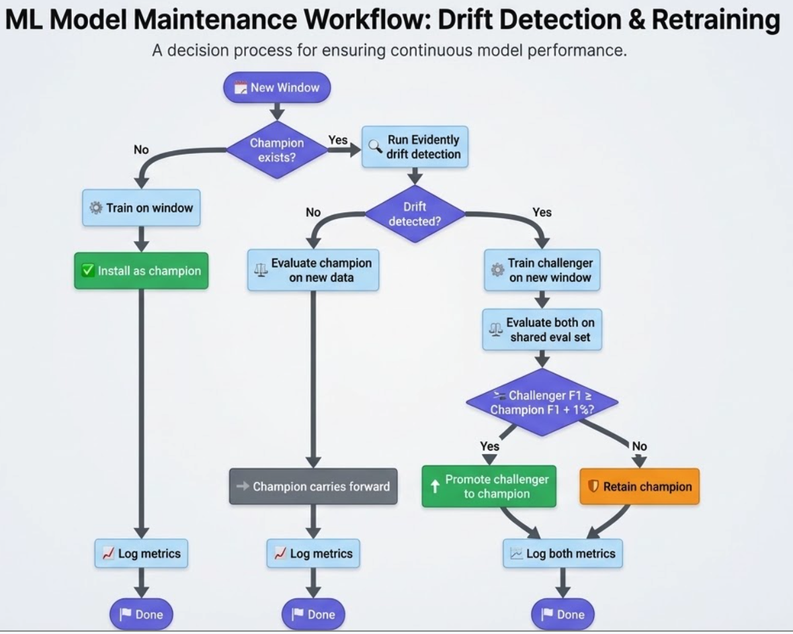
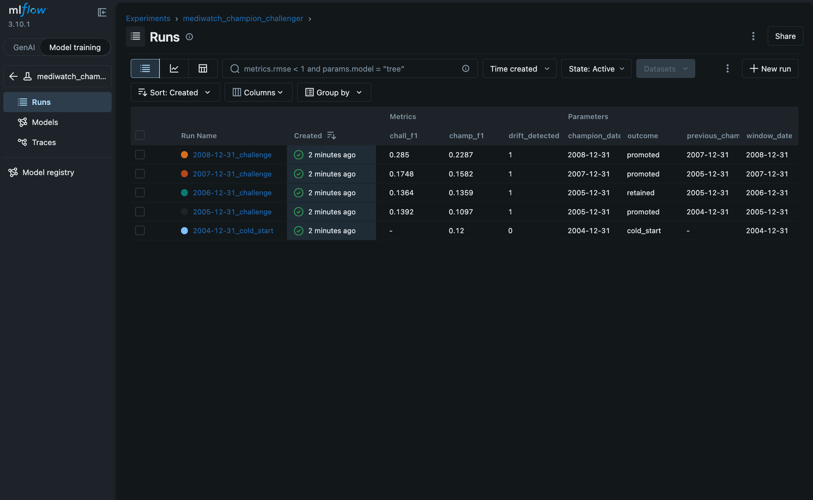
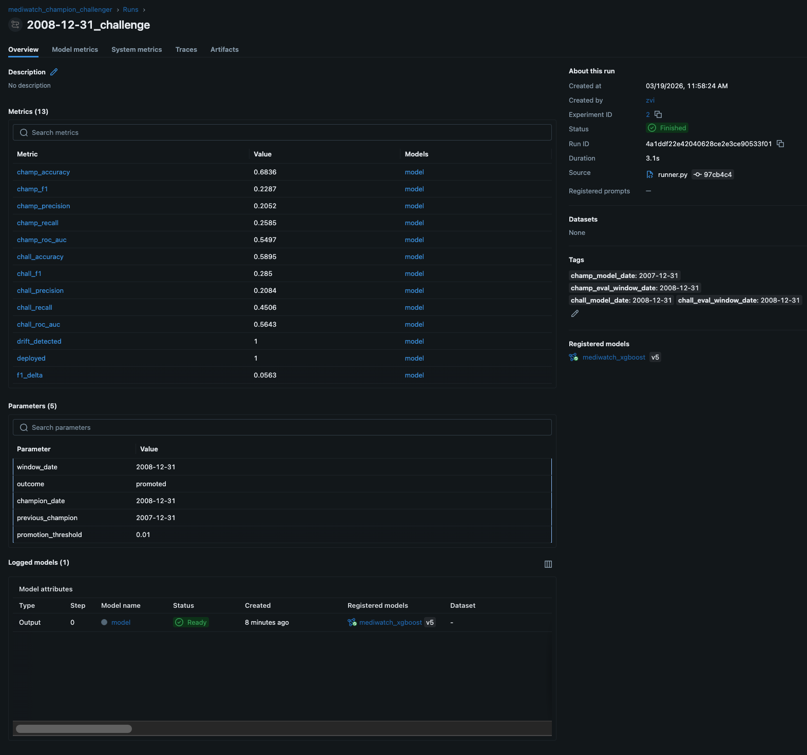
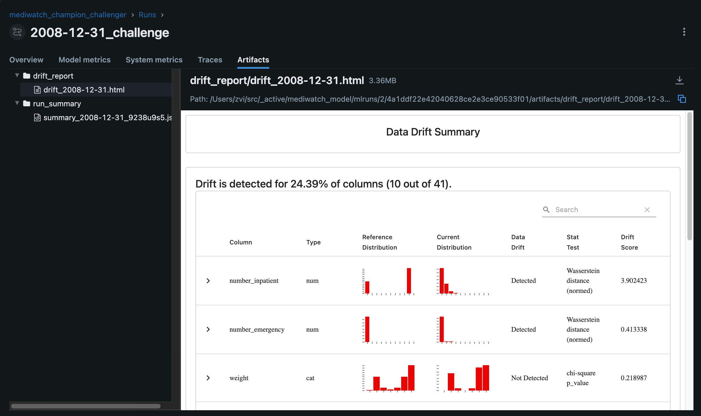
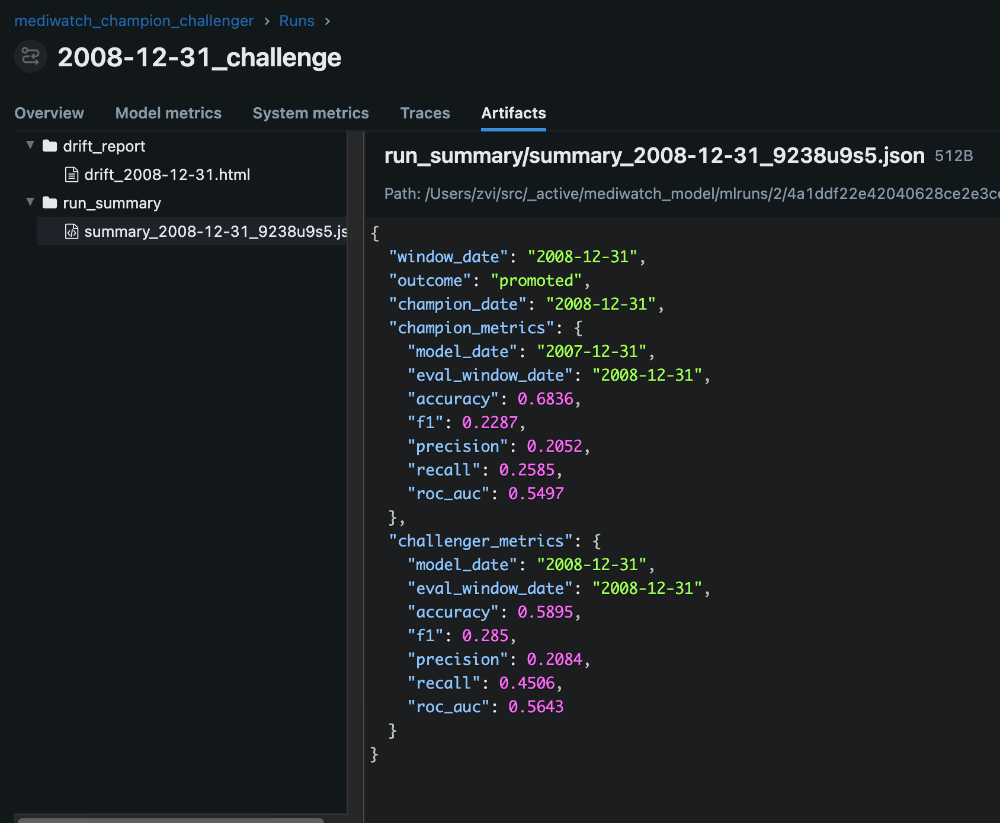
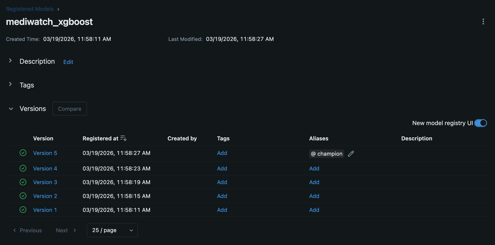

# Champion / Challenger Retraining Pipeline



A demonstration of automated model retraining with drift monitoring and gated promotion. The pipeline processes sequential time windows, trains a challenger model on each new window, and promotes it only when it measurably outperforms the incumbent champion on the current window's evaluation set.

## Why This Exists

Predictive models degrade as the data distribution shifts. The standard response — periodic retraining on a schedule — wastes compute when nothing has changed and reacts too slowly when something has. This project implements a champion/challenger evaluation loop that makes promotion decisions based on holdout performance, with drift analysis providing observational context.

The dataset is the [UCI Diabetes 130-Hospitals](https://archive.ics.uci.edu/dataset/296/diabetes+130-us+hospitals+for+years+1999-2008) readmission dataset, split into five annual windows (2004–2008). The prediction task — 30-day readmission — has limited signal (ROC-AUC 0.53–0.61 across windows), which is a known characteristic of this dataset in the literature. This makes the pipeline's job harder and the promotion decisions more interesting: the correct answer is sometimes "keep the old model."

## How It Works

```
Window 1 (cold start)         Windows 2–5 (warm start)
───────────────────           ──────────────────────────
Train model on window    →    Train challenger on window
Deploy as champion       →    Evaluate both on eval set
Log to MLflow            →    Promote if challenger F1
                               exceeds champion F1 by ≥ 1%
                         →    Log both to MLflow
                         →    Generate report
```

Each window produces an HTML report with three sections:

1. **Data** — Evidently drift and data quality analysis
2. **Model** — Side-by-side champion vs. challenger metrics on the current window's evaluation set
3. **Decision** — Promotion outcome with rationale

## Project Structure

```
├── generate_windows.py     # Slices raw data into frozen parquet snapshots
├── runner.py               # Simulation of champion/challenger train-eval process for windows.
├── src/
│   ├── __init__.py
│   ├── config.py            # paths, feature lists, constants
│   ├── data.py              # window loading, ds mapping
│   ├── preprocessing.py     # encoding, cleaning, pipeline
│   ├── training.py          # model fit + save
│   ├── evaluation.py        # metrics + save
│   └── drift.py             # evidently reports
│   └── mlflow_utils.py      # mlflow tools (for iteration)
├── windows/                 # Immutable windowed parquet files (by ISO date)
│   ├── 2004-12-31-train.parquet
│   ├── 2004-12-31-eval.parquet
│   ├── ...
│   └── 2008-12-31-eval.parquet
├── scripts/                 # Acceptance tests — not part of the pipeline
│   ├── verify_mlflow_registry.py  # End-to-end MLflow registry test on synthetic data
│   └── verify_mlflow_cleanup.py   # Verifies MLflow experiment/model cleanup
├── artifacts/
│   ├── pipelines/           # Serialized sklearn pipelines (champion + challengers)
│   ├── evaluations/         # metrics JSON per model per window
│   └── reports/             # evidently HTML per window
└── README.md
```

## Data & Features

The raw dataset is split into five year-long windows. Each window is further split into an 80/20 train/eval split (~16,000 train / ~4,000 eval per window), where the 20% evaluation split serves as the shared evaluation set for champion/challenger comparison.

**Numeric features (8):** hospital stay duration, procedure counts, medication counts, prior visit history.

**Categorical features (22):** demographics, admission metadata, medication flags — ordinal-encoded for tree-based models.

**Diagnosis features (12):** ICD-9 codes from three diagnosis fields are binned into clinical categories (circulatory, respiratory, diabetes, etc.) and collapsed into binary `is_diag_*` flags. A flag is 1 if *any* of the three diagnosis slots matches that category, removing noise from diagnosis ordering.

## Running the Pipeline

Make sure you have uv installed. (https://docs.astral.sh/uv/getting-started/installation/)

```bash
# 1. Prepare frozen window snapshots (one-time)
uv sync
uv run generate_windows.py

# 2. Run the full pipeline across all windows
uv run runner.py > runner.log
```

Output is written to `artifacts/`. Reports are archived under `artifacts/reports/drift_{window_date}.html`.

## MLflow Tracking

Each pipeline run logs metrics, parameters, artifacts, and model versions to MLflow.

**Experiment runs** — All windows appear as runs with champion/challenger metrics, promotion outcomes, and drift status:



**Single run detail** — Each run records both champion and challenger metrics, parameters (window date, outcome, previous champion), and links to the registered model version:



**Drift report artifact** — Evidently drift reports are logged as HTML artifacts, showing per-column distribution shifts:



**Run summary artifact** — A JSON summary capturing the promotion decision and side-by-side metrics:



**Model registry** — Every trained model is registered as a new version; the current champion gets the `@champion` alias:



## Key Design Decisions

**Champion/challenger over drift-triggered retraining.** Drift detection tells you the input distribution changed — not whether your model got worse. Evaluating on the most recent data answers the question that matters: does the new model actually perform better?

**Sliding window training under drift.** The pipeline trains the challenger model on a sliding 2-year window (current + previous) rather than just the current window. This prevents catastrophic forgetting and provides a robust, generalized anchor against concept drift. [Read the analysis here](docs/sliding_window_analysis.md).

**F1 as the promotion metric.** With ~12% positive class rate, accuracy is dominated by the majority class. F1 balances precision and recall and is more sensitive to meaningful changes in model behavior.

**1% improvement threshold.** Prevents promotion on noise. A challenger that matches the champion isn't worth the deployment risk.

**Single sklearn Pipeline artifact.** All custom feature engineering (missing value imputation, string casting, ICD-9 binning) and the predictive model are fully encapsulated within custom `scikit-learn` Transformers and serialized together into a single `.joblib` Pipeline. There is no separate data cleaning script needed at inference time, preventing training-serving skew.

## Caveats vs. Production

This is a portfolio demonstration, not a production system. Key gaps:

- **Delayed labels.** The per-window evaluation assumes labels are available at evaluation time. In production, challenger evaluation would run after a labeling lag window.
- **Rollback.** Artifact versioning supports reverting to a previous champion, but automated rollback on live performance degradation is not implemented.
- **Orchestration.** The pipeline runs as a sequential script. In production, this maps to an Airflow DAG with `max_active_runs=1`, where each run reads the champion state finalized by the previous run.
- **Weak signal.** ROC-AUC ranges from 0.54 to 0.61. The underlying prediction task is hard, and the pipeline correctly reflects that — some challengers are promoted, some are rejected. A higher-signal dataset (e.g., credit default with a pre/post-2008 split) would make drift effects more visually dramatic.

## Tools

- **scikit-learn** — Pipeline, ColumnTransformer, OrdinalEncoder, model training
- **Evidently** — Drift detection and data quality reports
- **MLflow** — Metric logging and model artifact tracking
- **pandas / numpy** — Data manipulation
